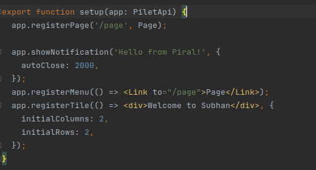

# Getting Started with Piral 

This project was Piral with [Create Piral App](https://github.com/facebook/create-react-app).

## Available Scripts

In the project directory, you can run:

## Check version of the Piral CLI

The piral-cli supports developers in executing the most important and can be installed.

## `npm i piral-cli -g`

## `piral --version`

Runs the app in the development mode.\
Open [http://localhost:1234](http://localhost:1234) to view it in your browser.

## Setup a new Piral Instance

A Piral instance can be created using `piral-cli`

## `piral new --target my-app`

Create the folder ./my-app the files for the newly created application shell.

## Run the Application Shell
Created Piral instance, navigate to the directory `my-app`

`npx` task runner is used to force using the local version of the `piral-cli`. This works in cases where you installed the Piral `CLI` globally, but also works if you preferred to use the npm initializer.

Build process is completed, the application shell can be opened locally in a browser. The output of the debug process shows the local address, which is usually [http://localhost:1234](http://localhost:1234)

# Create an npm package for the app shell

## `npx piral build`

## Only build the emulator

The previously used command builds both `release` and `emulator`.

## `npx piral build --type emulator`

# Pilet setup function 

There is a single function, which controls the configuration of a `pilet -` it is the setup method in the file `./src/index.tsx`

## Start the Pilet debug
As for the application shell, the pilet can be started in debug mode using the piral-cli

## `npx pilet debug`

When navigating to [http://localhost:1234](http://localhost:1234), the application shell will be started and the content of the pilet will be shown.

